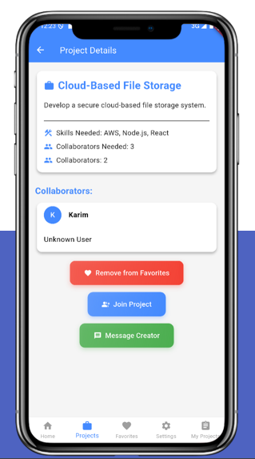
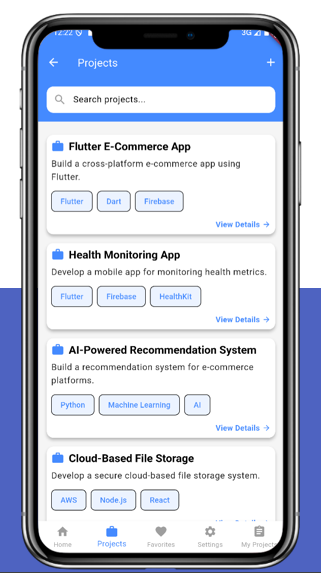
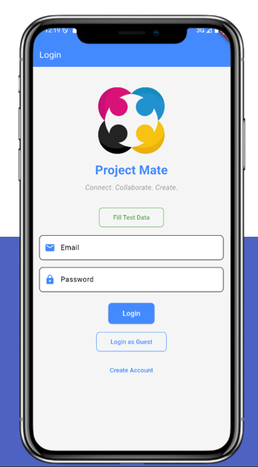
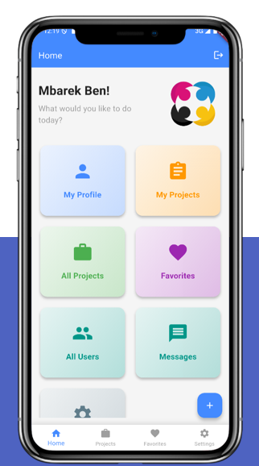

# StudentCollabHub

A modern Flutter mobile application designed to connect students and facilitate collaboration on academic projects. Whether you're looking for teammates for a group assignment, seeking specific skills for your project, or wanting to contribute your expertise to others, StudentCollabHub makes it easy to find the right collaborators.

## Screenshots

<div align="center">
  
  
  <br><br>
  
  
</div>

*From left to right: Home dashboard, Project browsing, Project details, and User profiles*

## Features

### 🎯 **Project Management**
- Create and publish project listings with detailed descriptions
- Specify required skills and number of collaborators needed
- Browse and search through available projects
- Save interesting projects to favorites

### 👥 **User Collaboration**
- Build comprehensive user profiles showcasing skills and experience
- Connect with other students through direct messaging
- View detailed profiles of potential collaborators
- Join projects that match your skills and interests

### 🔍 **Smart Discovery**
- Search projects by keywords, skills, or categories
- Filter projects based on collaboration requirements
- Discover users with complementary skills
- Get matched with relevant project opportunities

### 📱 **User Experience**
- Clean, intuitive mobile interface
- Real-time messaging system
- Profile customization and management
- Cross-platform compatibility (iOS & Android)

## Technical Stack

- **Frontend**: Flutter & Dart
- **Backend**: Firebase
  - Authentication (Firebase Auth)
  - Database (Cloud Firestore)
  - Cloud Storage
- **State Management**: Provider
- **Architecture**: MVVM Pattern

## Getting Started

### Prerequisites

Before running this application, make sure you have:

- Flutter SDK (version 3.5.4 or higher)
- Dart SDK
- Android Studio / Xcode for mobile development
- Firebase project with Firestore and Authentication enabled

### Installation

1. **Clone the repository**
   ```bash
   git clone https://github.com/MbarekTech/StudentCollabHub.git
   cd StudentCollabHub
   ```

2. **Install dependencies**
   ```bash
   flutter pub get
   ```

3. **Firebase Setup**
   
   a. Create a new Firebase project at [Firebase Console](https://console.firebase.google.com/)
   
   b. Enable Authentication and Firestore Database
   
   c. For Android:
   - Add your Android app to Firebase project
   - Download `google-services.json`
   - Replace the template file in `android/app/google-services.json`
   
   d. For iOS:
   - Add your iOS app to Firebase project
   - Download `GoogleService-Info.plist`
   - Add it to your iOS project in Xcode
   
   e. Update Firebase configuration:
   - Open `lib/firebase_options.dart`
   - Replace placeholder values with your actual Firebase configuration

4. **Run the application**
   ```bash
   # For Android
   flutter run
   
   # For iOS
   flutter run -d ios
   ```

## Project Structure

```
lib/
├── main.dart                 # Application entry point
├── firebase_options.dart     # Firebase configuration
├── models/                   # Data models
│   ├── project_model.dart
│   └── user_model.dart
├── screens/                  # UI screens
│   ├── home_screen.dart
│   ├── create_project_screen.dart
│   ├── project_listing_screen.dart
│   ├── profile_screen.dart
│   ├── messages_screen.dart
│   └── ...
├── services/                 # Business logic
│   ├── auth_service.dart
│   └── database_service.dart
└── state/                    # State management
    └── app_state.dart
```

## Configuration

### Firebase Configuration

1. **Authentication Methods**: Enable Email/Password authentication in Firebase Console
2. **Firestore Rules**: Configure appropriate security rules for your database
3. **Storage Rules**: Set up rules for file uploads if using Firebase Storage

### Environment Variables

Create a `.env` file in the root directory for any additional configuration:

```env
# Example environment variables
APP_NAME=StudentCollabHub
DEBUG_MODE=true
```

## Contributing

We welcome contributions to StudentCollabHub! Here's how you can help:

1. **Fork the repository**
2. **Create a feature branch**: `git checkout -b feature/amazing-feature`
3. **Make your changes** and test thoroughly
4. **Commit your changes**: `git commit -m 'Add amazing feature'`
5. **Push to the branch**: `git push origin feature/amazing-feature`
6. **Open a Pull Request**

### Development Guidelines

- Follow Flutter/Dart coding conventions
- Write clear, descriptive commit messages
- Add comments for complex logic
- Test your changes on both Android and iOS
- Update documentation as needed

## License

This project is licensed under the MIT License - see the [LICENSE](LICENSE) file for details.

## Support

If you encounter any issues or have questions:

1. Check the [Issues](https://github.com/MbarekTech/StudentCollabHub/issues) page
2. Create a new issue with detailed information
3. Contact the maintainers

## Acknowledgments

- Flutter team for the amazing framework
- Firebase for backend services
- All contributors who help improve this project

---

**Made with ❤️ for the student community**